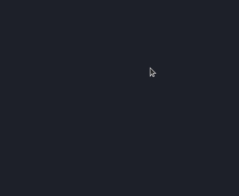

<p align="center">
  <image
  src="https://img.shields.io/github/languages/count/<your-nick>/<repo-name>"
  />
  <image
  src="https://img.shields.io/github/languages/top/<your-nick>/<repo-name>"
  />
  <image
  src="https://img.shields.io/github/last-commit/<your-nick>/<repo-name>"
  />
  <image
  src="https://img.shields.io/github/watchers/<your-nick>/<repo-name>?style=social"
  />
</p>

# 📋 Indíce

- [Proposta / objetivos ](#id01)
  - [O desafio](#id01.1)
  - [O que eu aprendi](#id01.2)
- [Screenshots](#id02)
- [Links](#id03)
- [Feito com](#id04)
- [Pré-requisitos](#id05)
- [Procedimentos de instalação](#id06)
- [Autor](#id07)

# 🚀 Proposta / objetivos <a name="id01"></a>

## :trophy: O desafio <a name="id01.1"></a>

## :pushpin: O que eu aprendi <a name="id01.2"></a>

# :camera_flash: Screenshots <a name="id02"></a>

## :iphone: Mobile design

<p  align="center">
  </img>
</p>

## :iphone: Tablets design

<p  align="center"></img></p>

## :desktop_computer: Desktop design

<p  align="center"></img></p>

## 🥇 result of my work

<p  align="center"></img></p>

<br />

# :dart: Links <a name="id03"></a>

<br />

- My figma design: [Figma](https://www.figma.com/)
- any documentation (notion, postman...): [doc](https://www.notion.so/)

<br />

# 🛠 Feito com <a name="id04"></a>

<br />

- Mobile-first workflow
- [React](https://reactjs.org/)
- [Styled components](https://styled-components.com)

<br />

# ☑️ Pré-requisitos <a name="id05"></a>

<br />

- [x] Editor de código de sua preferência (recomendado VS code)
- [x] Git
- [x] Gerenciador de pacotes Yarn ou NPM
- [x] ...qualquer outro requisito

<br />

# 📝 Procedimentos de instalação <a name="id06"></a>

<br />

Clone este repositório usando o comando:

```bash
git clone https://github.com/<your-nick>/<repo-name>.git
```

Na pasta do projeto instale as dependências com uso do npm ou yarn

```bash
npm install

ou

yarn install
```

<br />

# :sunglasses: Autor <a name="id07"></a>

<br />

- Personal Page - [your-name](your-url)
- Frontend Mentor - [your-page](your-url)
- Instagram - [your-@](your-url)
- GitHub - [your-nick](your-url)
